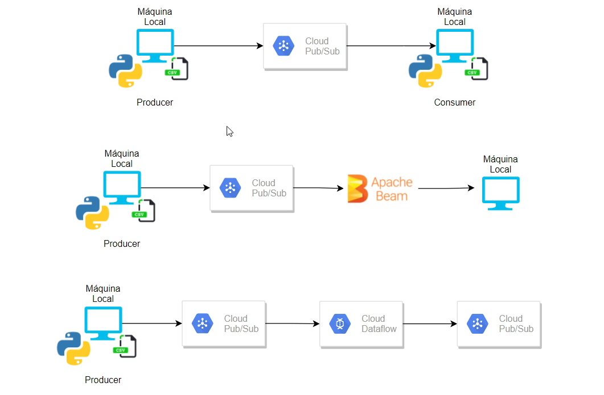

# 🚀 Data Engineering Pipelines with Apache Beam, Dataflow and Pub/Sub

Repository containing hands-on exercises and projects from the **Apache Beam + Dataflow + Pub/Sub (Udemy)** course.  
The focus is to understand **batch and streaming data processing** on Google Cloud, building end-to-end pipelines.

---

## 📂 Repository Structure
- `batch/` → Beam batch pipelines
  - Local → Local
  - Local → Google Cloud Storage (GCS)
  - GCS → GCS
  - GCS → BigQuery
- `streaming/` → streaming pipelines
  - Producer → publishes messages to Pub/Sub
  - Consumer → reads messages from Pub/Sub
  - Pipeline → integrates **Pub/Sub + Dataflow + Pub/Sub**

---

## 🛠️ Technologies Used
- **Apache Beam** → unified programming SDK for batch + streaming pipelines  
- **Google Cloud Dataflow** → fully managed execution of Beam pipelines  
- **Google Cloud Pub/Sub** → messaging system for event ingestion and consumption  
- **Google Cloud Storage (GCS)** → data lake for raw and processed data  
- **BigQuery** → data warehouse for analytics and querying  

---

## 📘 Key Concepts Practiced
### 🔹 Batch
- Building simple pipelines with Beam  
- Data movement between:
  - Local files
  - GCS buckets
  - BigQuery  
- Deploying pipelines on Dataflow for scalable execution  

### 🔹 Streaming
- Creating a **Publisher** in Pub/Sub to simulate real-time events  
- Developing a **Consumer** to process Pub/Sub messages  
- End-to-end integration **Pub/Sub → Dataflow → Pub/Sub** for continuous data flow  

---

## 💡 Example Use Cases
- **Batch:** Daily ETL job moving CSV files from GCS → transform with Beam → load into BigQuery.  
- **Streaming:** Real-time IoT/Log simulation with Pub/Sub, consumed by Dataflow for continuous processing.  